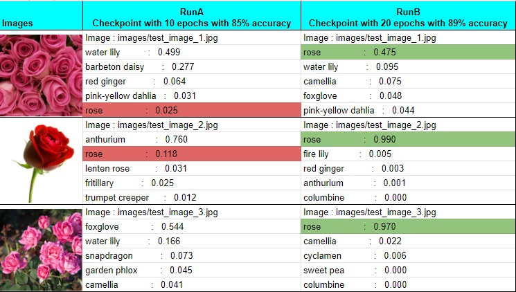

# Image Classifier
This is the Udacity final project for Nanodegree - Artificial Intelligence Programming with Python

**Part 1** of the project accomplishes training of a custom deep neural network classifier model on flower data set.

With the pretrained model **densenet201** and my custom classifier an accuracy of **85.166%** was achieved at the time of submission.  
Other models that can be used with this Image Classifier are **vgg16** with an accuracy of 79.714%
and **densenet121** with accuracy of 82.145%. Each of these models were run on a classifier with three hidden layers of size [120, 100, 80],
with a default dropout rate of 0.2, default learning rate of 0.003 for 10 epochs.

Further training of the model with pretrained network **densenet201** and my custom classifier, for increased number of epochs **showed promise**. With default learning rate and dropout, for **15 epochs**, though validation accuracy improved, testing accuracy dropped to **84%**. Retaining default learning rate and dropout values, and further training for **20 epochs** resulted in the best possible accuracy of **89.252%**.

**Code files** : Image Classifier Project.ipynb

**Part 2** of the project creates a command line python application to train and predict a sample image's most probable categories.

**Code files** : train.py, predict.py and network_utils.py

**Output files** : predict_output.txt

## Prediction testing on Windows10

Below is a comparison of prediction output for images that are not part of the "flowers" dataset. Two of the checkpoints used are **RunA**: densenet201 with 84% accuracy and **RunB**: densenet201 with 89% accuracy. RunA fails to predict images as *_Rose_* with higher probability. Clearly, **RunB offers better prediction**, with prediction as high as **0.99**

## Fixed Issues

1. Windows10 local run of predict.py fails during load_checkpoint.

Fix: map_location is set to device and passed through torch.load

2. Windows10 local run of predict.py fails to compare device as string.

Fix: Convert device type to str before comparing with "cpu"

3. Windows10 local run of predict.py fails to print verdict for non-dataset image.

Fix: Print actual flower name and verdict only for sample image from dataset "flowers"

